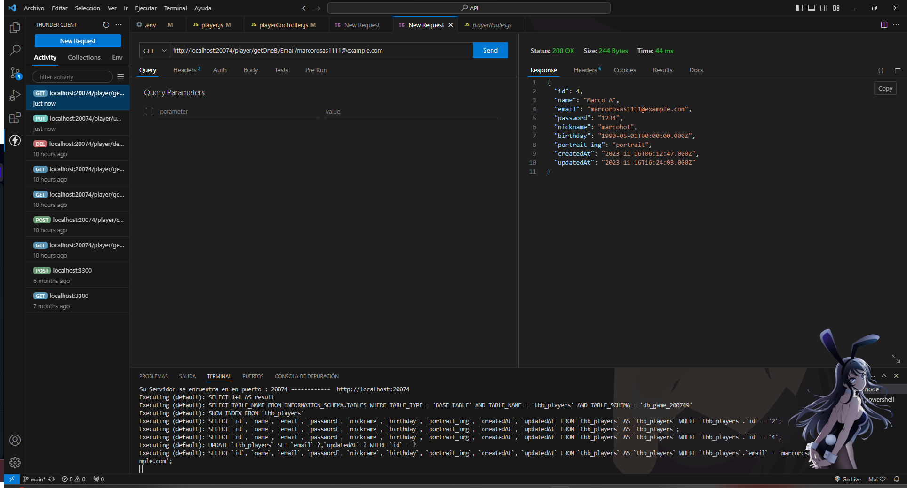
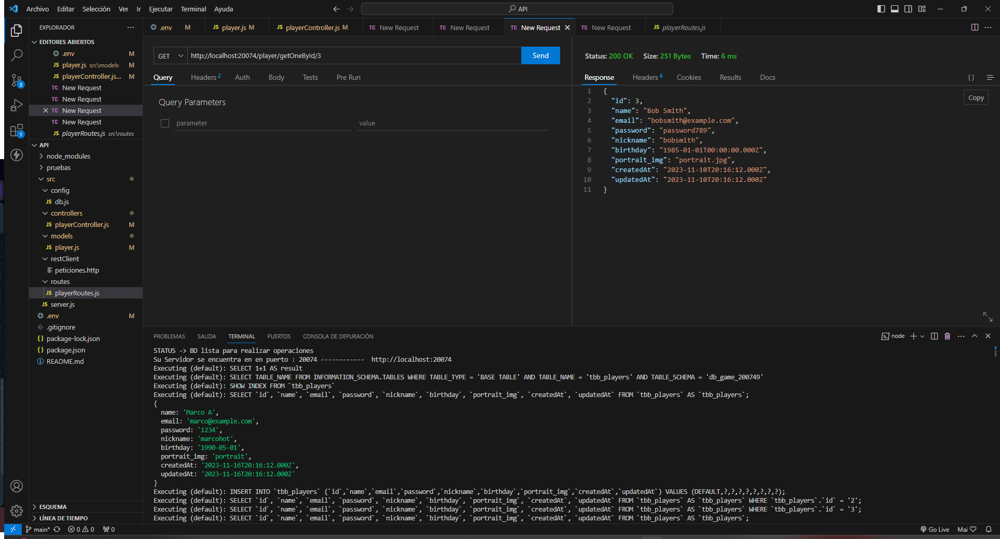
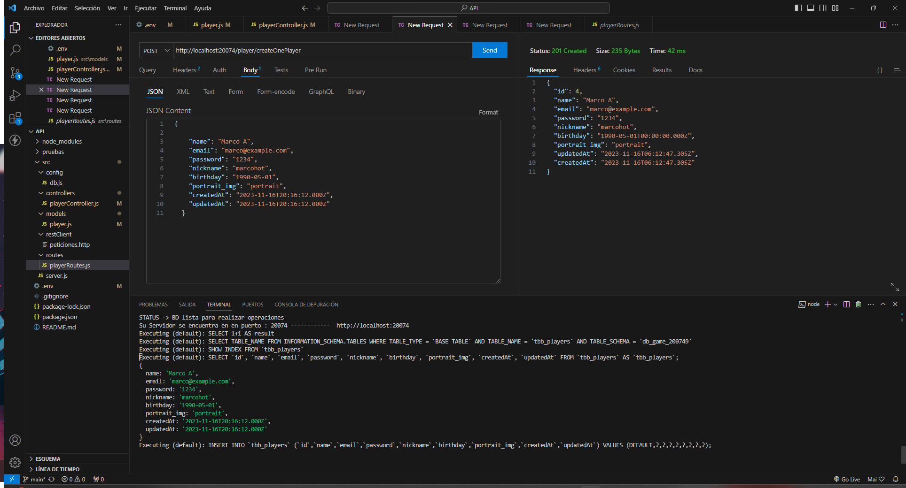

# DMI_practica17_200749

  
# Universidad Tecnológica de Xicotepec de Juárez

## Ingeniería en Desarrollo y Gestión de Software

## Desarrollo Movil Integral

## Marco Antonio Rosas Gonzalez
 
## 10° "A"

## Septiempre - Diciembre

## PRÁCTICA 17: Implementacion de la busqueda e insercion de los datos de los jugadores

## Descripción: Hemos creado un grupo de funciones para administrar una variedad de operaciones relacionadas con los jugadores en nuestro videojuego. Cada función está diseñada para llevar a cabo una tarea específica en los datos de un jugador dentro del sistema. Estas funciones requieren dos parámetros, "rq" y "rs", que representan la solicitud (request) y la respuesta (response) en el entorno del servidor. Durante la ejecución, cada función genera mensajes descriptivos en la consola, detallando la acción que se está realizando. Además, cada función devuelve un mensaje que indica la acción ejecutada.

Este conjunto de funciones forma parte de un API especializado en la gestión de jugadores, abordando diversas solicitudes, como la creación de jugadores, búsqueda, actualización de datos, cambio de foto de perfil y eliminación de jugadores. Este enfoque modular facilita la expansión y el mantenimiento de las operaciones relacionadas con los jugadores en nuestro videojuego.

